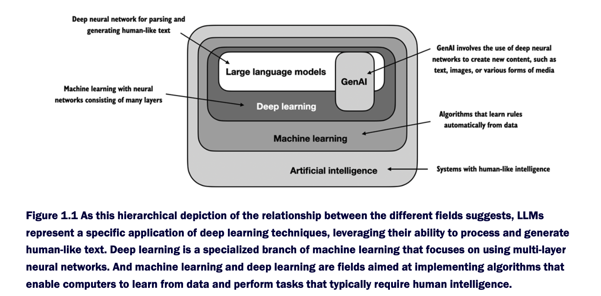
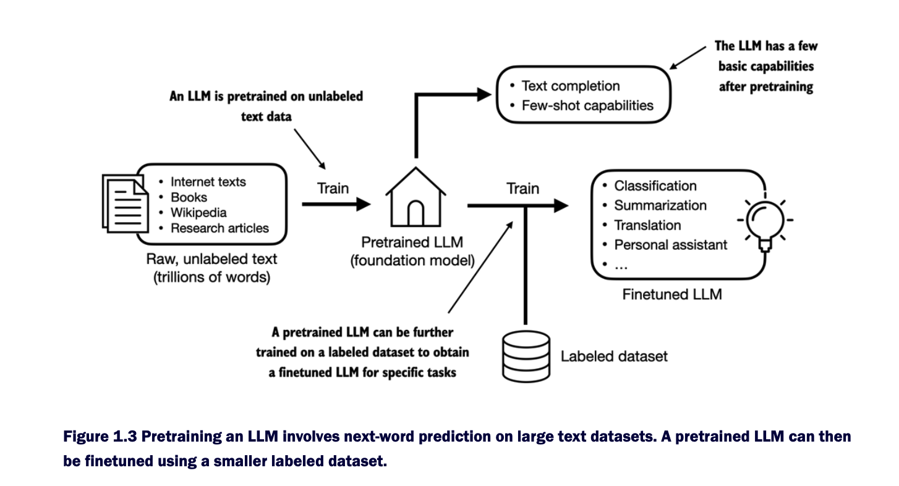
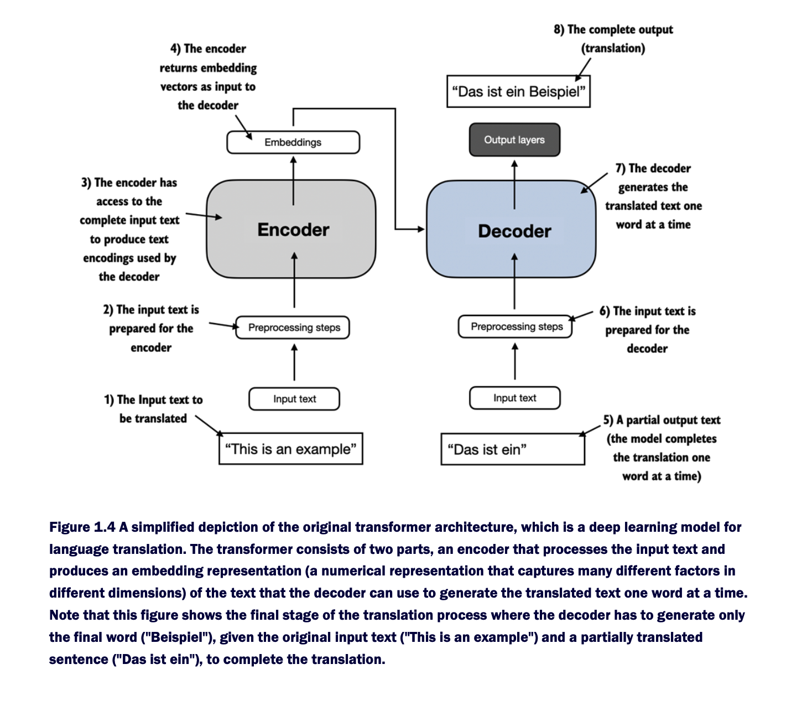
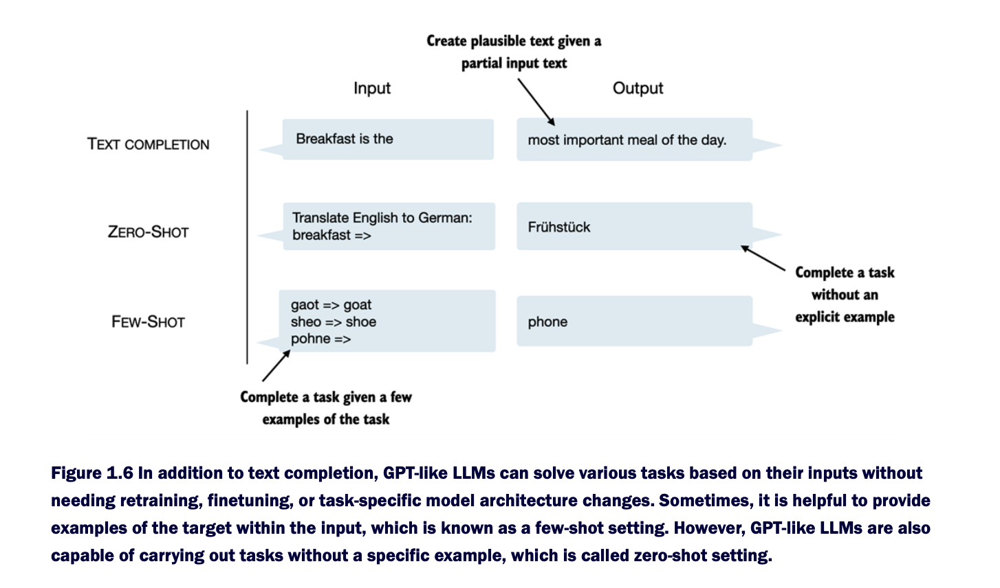
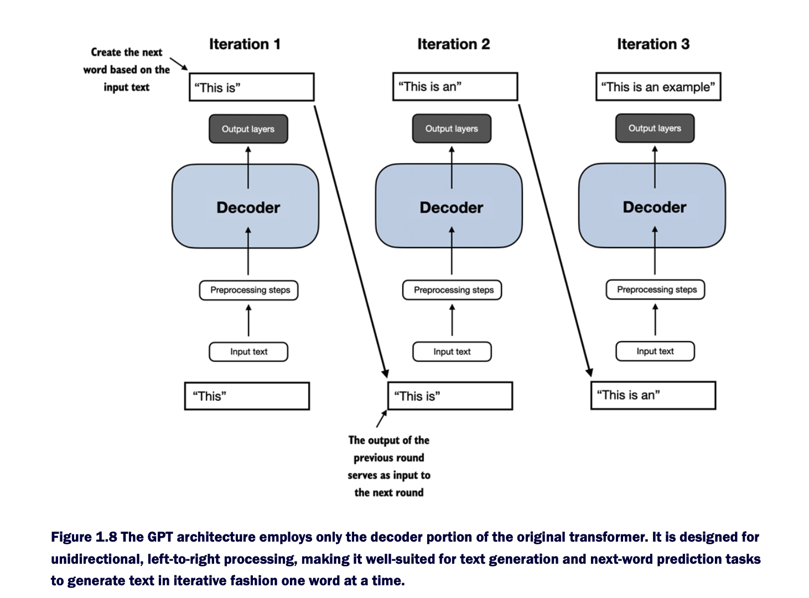
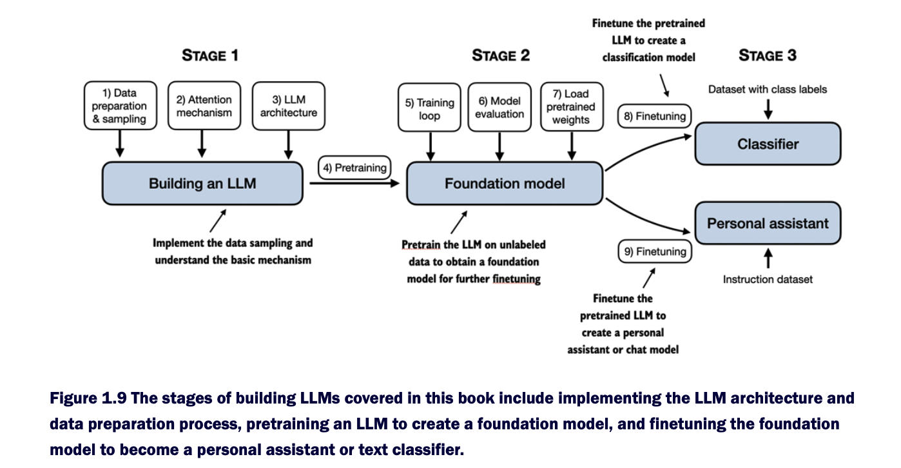

# Understanding Large Language Models

`Large language models (LLMs)`, such as those offered in OpenAI's ChatGPT, are deep neural network models that have been developed over the past few years. They ushered in a new era for Natural Language Processing (NLP). Before the advent of large language models, traditional methods excelled at categorization tasks such as email spam classification and straightforward pattern recognition that could be captured with handcrafted rules or simpler models. However, they typically underperformed in language tasks that demanded complex
understanding and generation abilities, such as parsing detailed instructions, conducting contextual analysis, or creating coherent and contextually appropriate original text. For example, previous generations of language models could not write an email from a list of keywords—a task that is trivial for contemporary LLMs.


LLMs have remarkable capabilities to understand, generate, and interpret human language. However, it's important to clarify that when we say language models "understand," we mean that they can process and generate text in ways that appear coherent and contextually relevant, not that they possess human-like consciousness or comprehension.


Enabled by advancements in deep learning, which is a subset of machine learning and artificial intelligence (AI) focused on neural networks, LLMs are trained on vast quantities of text data. This allows LLMs to capture deeper contextual information and subtleties of human language compared to previous approaches. As a result, LLMs have significantly improved performance in a wide range of NLP tasks, including text translation, sentiment analysis, question answering, and many more.


Another important distinction between contemporary LLMs and earlier NLP models is that these earlier NLP models were typically designed for specific tasks, for example, text categorization, language translation and so forth. Whereas those earlier NLP models excelled in their narrow applications, LLMs demonstrate a broader proficiency across a wide range of NLP tasks.


The success behind LLMs can be attributed to the transformer architecture which underpins many LLMs, and the vast amounts of data LLMs are trained on, allowing them to capture a wide variety of linguistic nuances, contexts, and patterns that would be challenging to manually encode.


This shift towards implementing models based on the transformer architecture and using large training datasets to train LLMs has fundamentally transformed NLP, providing more capable tools for understanding and interacting with human language.

---

## What is an LLM?

An LLM, a large language model, is a neural network designed to understand, generate, and respond to human-like text. These models are deep neural networks trained on massive amounts of text data, sometimes encompassing large portions of the entire publicly available text on the internet.


The "large" in large language model refers to both the model's size in terms of parameters and the immense dataset on which it's trained. Models like this often have tens or even hundreds of billions of parameters, which are the adjustable weights in the network that are optimized during training to predict the next word in a sequence. Next-word prediction is sensible because it harnesses the inherent sequential nature of language to train models on understanding context, structure, and relationships within text. Yet, it is a very simple task and so it is surprising to many researchers that it can produce such capable models.


LLMs utilize an architecture called the `transformer`, which allows them to pay selective attention to different parts of the input when making predictions, making them especially adept at handling the nuances and
complexities of human language.

Since LLMs are capable of generating text, LLMs are also often referred to as a form of `generative artificial intelligence (AI)`, often abbreviated as `generative AI` or `GenAI`. AI encompasses the broader field of creating machines that can perform tasks requiring `human-like intelligence`, including understanding language, recognizing patterns, and making decisions, and includes subfields like machine learning and deep learning.





The algorithms used to implement AI are the focus of the field of machine learning. Specifically, machine learning involves the development of algorithms that can learn from and make predictions or decisions based on data without being explicitly programmed. To illustrate this, imagine a spam filter as a practical application of machine learning. Instead of manually writing rules to identify spam emails, a machine learning algorithm is fed examples of emails labeled as spam and legitimate emails. By minimizing the error in its predictions on a training dataset, the model then learns to recognize patterns and characteristics indicative of spam, enabling it to classify new emails as either spam or legitimate.


`Deep learning` is a subset of machine learning that focuses on utilizing neural networks with three or more layers (also called `deep neural networks`) to model complex patterns and abstractions in data. In contrast to deep learning, `traditional machine learning` requires manual feature extraction. This means that human experts need to identify and select the most relevant features for the model.

While the field of AI is nowadays dominated by machine learning and deep learning, it also includes other approaches, for example, using `rule-based systems`, `genetic algorithms`, `expert systems`, `fuzzy logic`, or `symbolic reasoning`.

Returning to the spam classification example, in traditional machine learning, human experts might manually extract features from email text such as the frequency of certain trigger words ("prize," "win," "free"), the number of exclamation marks, use of all uppercase words, or the presence of suspicious links. This dataset, created based on these expert-defined features, would then be used to train the model. In contrast to traditional machine learning, deep learning does not require manual feature extraction. This means that human experts do not need to identify and select the most relevant features for a deep learning model. (However, in both traditional machine learning and deep learning for spam classification, you still require the collection of labels, such as spam or non-spam, which need to be gathered either by an expert or users.)


---

## Applications of LLMs

Owing to their advanced capabilities to parse and understand `unstructured text data`, LLMs have a broad range of applications across various domains. Today, LLMs are employed for 
- `machine translation`, 
- `generation of novel texts`, 
- `sentiment analysis`, 
- `text summarization`, 
- and many other tasks. 

LLMs have recently been used for content creation, such as writing fiction, articles, and even computer code.


- LLMs can also power sophisticated `chatbots` and `virtual assistants`, such as OpenAI's ChatGPT or Google's Gemini (formerly called Bard), which can answer user queries and augment traditional search engines such as Google Search or Microsoft Bing.

- Moreover, LLMs may be used for effective knowledge retrieval from vast volumes of text in specialized areas such as medicine or law. This includes sifting through documents, summarizing lengthy passages, and answering technical questions.

- In short, LLMs are invaluable for automating almost any task that involves parsing and generating text. Their applications are virtually endless, and as we continue to innovate and explore new ways to use these models, it's clear that LLMs have the potential to redefine our relationship with technology, making it more conversational, intuitive, and accessible.

---

## Stages of building and using LLMs

Research has shown that when it comes to modeling performance, custom-built LLMs those tailored for specific tasks or domains can outperform general-purpose LLMs, such as those provided by ChatGPT, which are designed for a wide array of applications. Examples of this include `BloombergGPT`, which is specialized for finance, and LLMs that are tailored for medical question answering.

Using custom-built LLMs offers several advantages, particularly regarding data privacy. For instance, companies may prefer not to share sensitive data with third-party LLM providers like OpenAI due to confidentiality concerns. Additionally, developing custom LLMs enables deployment directly on customer devices, such as laptops and smartphones. This local implementation can significantly decrease latency and reduce server-related costs. Furthermore, custom LLMs grant developers complete autonomy, allowing them to control updates and modifications to the model as needed.

The general process of creating an LLM includes `pretraining` and `finetuning`. The term `"pre"` in `"pretraining"` refers to the initial phase where a model like an LLM is trained on a large, diverse dataset to develop a broad understanding of language. This pretrained model then serves as a foundational resource that can be further refined through `finetuning`, a process where the model is specifically trained on a `narrower dataset` that is more specific to particular tasks or domains. This two-stage training approach consisting of pretraining and finetuning is depicted in Figure below.





### Pretraining

*   **Definition:** The initial, large-scale training phase where a model learns the fundamental patterns of a language (e.g., English, code) by predicting the next word in a vast amount of unlabeled text. This builds a **general-purpose "base model"** with broad world knowledge and grammar skills, but no specific instruction-following ability.
  
*   **Analogy:** Teaching a student the entire encyclopedia—giving them broad knowledge about the world, but not teaching them how to write a specific essay or answer an exam question.
  
*   **Example:** Training a model on a massive corpus like books, websites, and articles. After pretraining, if you prompt it with `"The capital of France is"`, it will likely complete it with `"Paris"`. However, if you ask it `"Write a poem about Paris,"` it may fail or produce a low-quality result because it wasn't trained to *follow instructions*.


### Finetuning

*   **Definition:** The subsequent, targeted training process where a **pretrained base model** is further trained on a smaller, specialized dataset to adapt it for a specific task or style. This requires significantly less data and compute than pretraining.
*   
*   **Analogy:** Taking the broadly knowledgeable student and giving them a intensive course on a specific profession, like law or medicine, so they can perform expertly in that domain.
*   
*   **Example:** Taking the base model (e.g., Llama 3) and finetuning it on a dataset of customer service conversations. The resulting model loses some of its general knowledge but becomes highly adept at its new task: understanding customer queries and responding in a helpful, conversational tone.


### Categories of fine-tuning for LLMs

#### 1. Instruction Fine-Tuning (Most Common)

*   **Goal:** Teach the general-purpose base model to **follow instructions** and respond in a desired chat-like format.

*   **How:** Train on a dataset of prompts and their ideal completions (e.g., `{"instruction": "Write a poem", "response": "Roses are red..."}`).
  
*   **Result:** Turns a "completion model" (that just continues text) into a "chat model" (that answers questions). This is a prerequisite for making a model useful and safe.
  
*   **Example:** **Alpaca**, **Vicuna**, and **Mistral Instruct** are all instruction-tuned versions of their base models.


#### 2. Domain-Specific Fine-Tuning

*   **Goal:** Inject deep expertise into a model for a **specialized field** (e.g., law, medicine, finance).

*   **How:** Continue training the model on a high-quality corpus of text from that specific domain.

*   **Result:** The model becomes much more proficient in the terminology, concepts, and style of that domain, often at a slight cost to its general knowledge.

*   **Example:** **BloombergGPT** is domain-tuned on financial data. **BioMedLM** is tuned on biomedical literature.


#### 3. Task-Specific Fine-Tuning

*   **Goal:** Optimize the model for a **single, narrow task** that often has a structured output.

*   **How:** Train on examples specific to that task.

*   **Result:** The model becomes highly reliable and accurate for that one task.

*   **Example:**
    *   **Text Classification:** Fine-tune to classify customer emails as "Complaint," "Inquiry," or "Spam."

    *   **Named Entity Recognition (NER):** Fine-tune to find and tag names of people, companies, and locations in text.

    *   **Code Generation:** Fine-tune on pairs of natural language descriptions and code snippets.


#### 4. Alignment Tuning (RLHF / DPO)

*   **Goal:** **Align** the model's outputs with human preferences: making them more helpful, harmless, and honest. It shapes the *style* and *safety* of responses, not just the knowledge.

*   **How:** Uses techniques like **Reinforcement Learning from Human Feedback (RLHF)** or the newer **Direct Preference Optimization (DPO)**. The model learns from human rankings of which responses are better.
  
*   **Result:** The model learns to refuse harmful requests, give less biased answers, and provide more concise and helpful responses.

*   **Example:** **ChatGPT** underwent heavy RLHF to make it conversational and safe. This is why it refuses to answer certain questions that its base model, GPT-4, technically "knows" the answer to.


#### Key Distinction: **Full vs. Parameter-Efficient Fine-Tuning (PEFT)**

This is a *methodological* category that cuts across the types above.

*   **Full Fine-Tuning:** Update **all** of the model's billions of parameters. This is powerful but extremely computationally expensive and can cause "catastrophic forgetting" (the model forgets its general knowledge).

*   **Parameter-Efficient Fine-Tuning (PEFT):** Only update a **small subset** of parameters or add tiny new layers. This is far cheaper, faster, and avoids catastrophic forgetting.
    *   **Main Technique: LoRA (Low-Rank Adaptation)** is the current industry standard. It freezes the original model and trains small "adapter" matrices that are then loaded alongside it for inference.

---

## Introducing the transformer architecture

Most modern LLMs rely on the `transformer architecture`, which is a deep neural network architecture introduced in the 2017 paper `Attention Is All You Need`. To understand LLMs we briefly have to go over the original transformer, which was originally developed for machine translation, translating English texts to German and French. A simplified version of the transformer architecture is depicted in the figure below;




The transformer architecture depicted in the. figure above consists of two submodules, an `encoder` and a `decoder`. The `encoder` module processes the input text and `encodes` it into a series of numerical representations or vectors that capture the contextual information of the input. Then, the `decoder` module takes these encoded vectors and generates the output text from them. In a translation task, for example, the `encoder` would encode the text from the source language into vectors, and the `decoder` would decode these vectors to generate text in the target language. Both the `encoder` and `decoder` consist of many layers connected by a so-called `self-attention mechanism`. 


A key component of `transformers` and LLMs is the `self-attention mechanism`, which allows the model to weigh the importance of different words or tokens in a sequence relative to each other. This mechanism enables the model to capture long-range dependencies and contextual relationships within the input data, enhancing its ability to generate coherent and contextually relevant output.


### The Core Idea

The Transformer is a neural network architecture designed to handle sequential data (like text) **without using recurrence** (like RNNs). It relies entirely on a mechanism called **self-attention** to weigh the importance of all words in a sentence when processing any single word.


### Key Components

#### 1. Self-Attention

This is the engine. For any given word, it calculates a weighted sum of the representations of *all other words* in the sentence. The weights (attention scores) determine how much focus to put on each other word when encoding the current one.

*   **Analogy:** When reading the word "**it**" in a sentence, self-attention lets the model look at all other words to figure out what "it" refers to. The words "**cat**" and "**sat**" would get high attention scores.

#### 2. Encoder-Decoder Structure (The Original Design)

*   **Encoder:** Processes the input sequence (e.g., an English sentence). It's built from a stack of identical layers, each containing a **self-attention** mechanism and a **feed-forward neural network**.
  
*   **Decoder:** Generates the output sequence (e.g., a French translation). Its layers have **self-attention**, **encoder-decoder attention** (which focuses on the encoder's output), and a **feed-forward network**.

#### 3. Positional Encoding

Since the model processes all words simultaneously (unlike RNNs), it has no inherent sense of word order. **Positional encodings** are unique vectors added to each word's embedding to give the model information about the position of each word in the sequence.

---

#### The Shortest Possible Summary

The Transformer is an **attention-based architecture** that:
1.  **Embeds** words into vectors.
2.  Adds **positional information**.
3.  Uses **self-attention** to understand context from all words at once.
4.  Processes this through **feed-forward networks** to generate an output.

This parallelizable design made it massively faster and more powerful than previous models, leading directly to the modern era of LLMs like GPT and Bard. Most of today's famous LLMs (GPT, Llama, etc.) are **decoder-only** transformers, using just the decoder part of this original structure.


Later variants of the transformer architecture, such as the so-called `BERT` (short for bidirectional encoder representations from transformers) and the various `GPT` models (short for generative pretrained transformers), built on this concept to adapt this architecture for different tasks.

`BERT`, which is built upon the original transformer's encoder submodule, differs in its training approach from GPT. While GPT is designed for `generative tasks`, `BERT` and its variants specialize in masked word prediction, where the model predicts masked or hidden words in a given sentence. This unique training strategy equips `BERT` with strengths in text classification tasks, including `sentiment prediction` and
`document categorization`. 

`GPT`, on the other hand, focuses on the `decoder` portion of the original transformer architecture and is designed for tasks that require generating texts. This includes `machine translation`, `text summarization`, `fiction writing`, `writing computer code`, and more. 


`GPT` models, primarily designed and trained to perform text completion tasks, also show remarkable versatility in their capabilities. These models are adept at executing both `zero-shot` and `few-shot` learning tasks. `Zero-shot learning` refers to the ability to generalize to completely unseen tasks without any prior specific examples. On the other hand, `few-shot learning` involves learning from a minimal number of examples the user provides as input.





### Core Concept of Zero-shot and Few-shot learning.

Both are techniques where a pre-trained model performs a task **it was not explicitly trained to do**. This ability emerges from the vast knowledge a model gains during its initial pre-training on internet-scale data.

---

#### 1. Zero-Shot Learning

*   **Definition:** The model performs a task immediately, **without any examples**. You just give it a natural language instruction.
  
*   **How it works:** You rely entirely on the model's pre-existing knowledge and its ability to understand the prompt's intent.

*   **Example:**
    *   **Prompt:**
        ```
        Classify the text: "This movie had incredible visuals but a weak plot."
        Sentiment: 
        ```
    *   **Model Output (likely):** `Negative`

    *   The model wasn't trained on a sentiment dataset for this specific call. It uses its general understanding of the words "incredible" (positive) and "weak" (negative) to reason about the overall sentiment.


#### 2. Few-Shot Learning

*   **Definition:** You give the model **a few examples** of the task within the prompt (called "in-context learning"). This helps it understand the pattern, format, and style you want.
  
*   **How it works:** The examples act as a mini-tuning session, priming the model to perform the task accurately without updating its weights.
  
*   **Example:**
    *   **Prompt:**
        ```
        Translate English to French:
        sea otter => loutre de mer
        peppermint => menthe poivrée
        plush girafe => girafe peluche
        cheese => 
        ```
    *   **Model Output (likely):** `fromage`

    *   The model infers the translation task from the provided examples and follows the pattern.


#### Key Difference & Analogy

| | **Zero-Shot** | **Few-Shot** |
| :--- | :--- | :--- |
| **Definition** | No examples provided. | A few examples provided in the prompt. |
| **Analogy** | Asking a brilliant student a random question out of the blue. | Giving the same student a few solved problems first, then asking a new one. |
| **Reliability** | Less reliable. Depends heavily on prompt clarity and model knowledge. | More reliable. The examples dramatically reduce ambiguity and guide the output. |

In short: **Zero-shot** is "figure it out," while **few-shot** is "here's the pattern, now follow it." Few-shot learning almost always yields better and more consistent results.


---

## Utilizing large datasets

The large training datasets for popular `GPT`- and `BERT`-like models represent diverse and comprehensive text corpora encompassing billions of words, which include a vast array of topics and natural and computer languages.

The scale and diversity of this training dataset allows these models to perform well on diverse tasks including language syntax, semantics, and context, and even some requiring general knowledge.


---

## A closer look at the GPT architecture

GPT-3 is a scaled-up model that has more parameters and was trained on a larger dataset. The next-word prediction task is a form of `self-supervised learning`, which is a form of `self-labeling`. This means that we don't need to collect labels for the training data explicitly but can leverage the structure of the data itself: we can use the next word in a sentence or document as the label that the model is supposed to predict. Since this next-word prediction task allows us to create labels "on the fly," it is possible to leverage massive unlabeled text datasets to train LLMs.

The general GPT architecture is relatively simple. Essentially, it's just the decoder part without the encoder. Since decoder-style models like GPT generate text by predicting text one word at a time, they are considered a type of autoregressive model. `Autoregressive models` incorporate their previous outputs as inputs for future predictions. Consequently, in GPT, each new word is chosen based on the sequence that precedes it, which improves coherence of the resulting text.

Architectures such as `GPT-3` are also significantly larger than the original transformer model. For instance, the original transformer repeated the encoder and decoder blocks six times. `GPT-3` has `96` transformer layers and `175 billion` parameters in total.





The ability to perform tasks that the model wasn't explicitly trained to perform is called an `"emergent behavior."` This capability isn't explicitly taught during training but emerges as a natural consequence of the model's exposure to vast quantities of multilingual data in diverse contexts. The fact that GPT models can "learn" the translation patterns between languages and perform translation tasks even though they weren't specifically trained for it demonstrates the benefits and capabilities of these large-scale, generative language models. We can perform diverse tasks without using diverse models for each.


---


## Building a large language model



**Stage 1:**
- Data Preparation and sampling
- Attention Mechanism
- LLM architecture
- Pretraining

**Stage 2:** 
- Training loop
- Model evaluation
- Load pretrained weights
  
**Stage 3:**
- Finetuning
- Instruction dataset


### 1. Data Acquisition & Curation

*   **Goal:** Assemble a massive, high-quality text corpus.

*   **Process:** Source trillions of words from diverse sources (books, code, web pages, academic papers). rigorously clean and filter the data for quality, remove duplicates, and deduplicate to prevent memorization.


### 2. Pre-training

*   **Goal:** Teach the model the fundamentals of language and world knowledge.

*   **Process:** The model learns to predict the next word in a sequence (autoregressive) or a masked word within a sequence. This is done on vast GPU clusters, consuming immense compute resources to adjust billions of parameters.


### 3. Fine-Tuning & Alignment

*   **Goal:** Specialize the general pre-trained model for useful and safe interaction.

*   **Process:**
    *   **Supervised Fine-Tuning (SFT):** Train on curated prompt-response pairs to teach it to follow instructions.
    *   **Alignment (RLHF/DPO):** Use human feedback to refine its outputs, making them more helpful, honest, and harmless.


### 4. Evaluation & Red-Teaming

*   **Goal:** Rigorously test the model's capabilities and safety.
  
*   **Process:** Benchmark performance on standardized tests (e.g., MMLU) and for specific tasks. Actively try to provoke failures, biases, or harmful outputs to identify and mitigate weaknesses.


### 5. Deployment & Serving

*   **Goal:** Make the model available for use with high performance and reliability.

*   **Process:** Optimize the model (e.g., via quantization) and host it on scalable infrastructure using specialized inference servers (e.g., vLLM, TGI) to handle user queries.


### 6. Continuous Feedback & Iteration

*   **Goal:** Maintain and improve the model post-launch.

*   **Process:** Monitor real-world usage, collect data on errors or shortcomings, and use this to create new data for further fine-tuning and releasing improved model versions.


